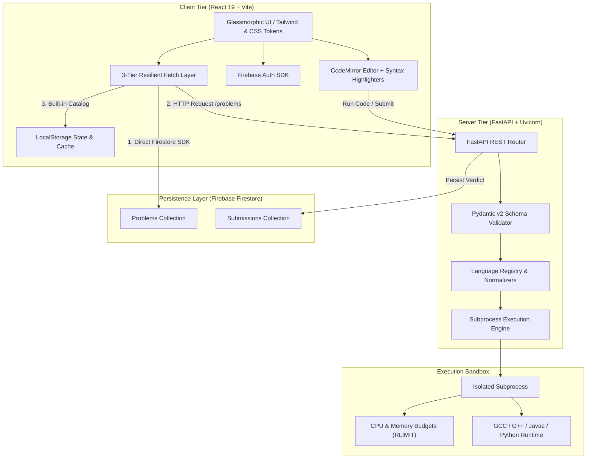

# ☁️ Cloudline (Cloud-Line OS)

> **Next-Generation Cloud-Native Code Execution Sandbox & Algorithmic Problem Solving Platform**

[](https://fastapi.tiangolo.com/)
[](https://react.dev/)
[](https://vitejs.dev/)
[](https://firebase.google.com/)
[](https://python.org)
[](https://isocpp.org/)
[](https://openjdk.org/)
[](LICENSE)

---

## 📌 Table of Contents

- [💡 Project Overview](#-project-overview)
- [✨ Key Features](#-key-features)
- [🏗️ System Architecture](#️-system-architecture)
- [🛠️ Tech Stack](#️-tech-stack)
- [📡 API Specification](#-api-specification)
- [🚀 Quick Start & Installation](#-quick-start--installation)
  - [Prerequisites](#prerequisites)
  - [1. Backend Setup](#1-backend-setup)
  - [2. Frontend Setup](#2-frontend-setup)
- [🧩 Problem Catalog & Seeding](#-problem-catalog--seeding)
- [🛡️ Execution Sandboxing & Limits](#️-execution-sandboxing--limits)
- [🏆 Hackathon Highlights & Judge Pitch](#-hackathon-highlights--judge-pitch)
- [🗺️ Future Roadmap](#️-future-roadmap)
- [👥 Authors & Acknowledgments](#-authors--acknowledgments)

---

## 💡 Project Overview

**Cloudline** is a modern, light-filled coding platform and isolated execution environment built to eliminate the clunky, distracting experience of legacy online judges. Styled with a calming **"Clear Skies" glassmorphism theme**, Cloudline offers an all-in-one suite for practicing coding problems, running custom scripts in a sandbox playground, and tracking developer metrics in real time.

### Why Cloudline?
- **Zero Friction**: Run and submit multi-language code (Python 3, C, C++, Java) with instant execution feedback.
- **Fail-Safe Resilience**: Designed for hackathons and live demos with a **3-tier failover mechanism** (Firebase Firestore → FastAPI Server → Offline In-Memory Problem Catalog), ensuring zero downtime even under network or cold-start hiccups.
- **Developer-Centric Sandboxing**: Accurate per-testcase grading, stdout/stderr isolation, precise execution timing, and compiler error line-number mapping.

---

## ✨ Key Features

| Feature | Description |
|---|---|
| ⚡ **Multi-Language Execution Engine** | Compiles and executes code in Python 3, C (GCC), C++17 (G++), and Java 21 with automatic Java `public class Solution` normalization. |
| 🧪 **Interactive Playground IDE** | Standalone editor with custom `stdin` input, formatted `stdout`/`stderr` terminal, script import/export (`.py`, `.cpp`, `.c`, `.java`), and local snippet persistence. |
| 🧩 **Algorithmic Judge & Test Suites** | Evaluates code against structured test suites with per-case pass/fail badges, custom execution time reporting, and verdicts (`Accepted`, `Wrong Answer`, `Time Limit Exceeded`, `Runtime Error`). |
| 📊 **Developer Analytics Dashboard** | Real-time SVG circular completion progress, difficulty breakdown (☀️ Easy, ⛅ Medium, ⛈️ Hard), submission history, and saved workspace scripts. |
| 🔐 **Flexible Authentication** | Firebase Auth (Email/Password & Google Sign-In) with full support for seamless guest sessions and local browser persistence. |
| 🎨 **"Clear Skies" Aesthetic UI** | Fluid CSS cloud animations, accessible typography, CodeMirror syntax highlighting, and responsive glassmorphic cards. |

---

## 🏗️ System Architecture



---

## 🛠️ Tech Stack

### Frontend
- **Framework**: React 19 + Vite 8
- **Routing**: React Router v7
- **Code Editor**: CodeMirror 6 (`@uiw/react-codemirror`) with Python, C++, and Java syntax packages
- **Authentication & DB SDK**: Firebase Client SDK v12
- **Styling**: Vanilla CSS with custom design tokens, CSS variables, and glassmorphic micro-animations

### Backend
- **Framework**: FastAPI (Python 3.10+)
- **Server**: Uvicorn ASGI
- **Validation**: Pydantic v2
- **Cloud Administration**: Firebase Admin SDK
- **Compilers / Toolchains**: GCC (MinGW-w64 / MSYS2 ucrt64 / Linux build-essential), OpenJDK 21, Python 3

---

## 📡 API Specification

Interactive Swagger documentation is available out of the box at **`http://localhost:8000/docs`**.

### Core Endpoints

| Method | Endpoint | Description |
|:---:|---|---|
| `GET` | `/` | Backend health check |
| `GET` | `/languages` | Returns supported languages and configurations |
| `POST` | `/run` | Runs arbitrary code against custom `stdin` |
| `POST` | `/submit` | Grades code against problem test cases and logs submission |
| `GET` | `/problems/` | Retrieves all problems from Firestore |
| `GET` | `/problems/{id}` | Retrieves a single problem by ID or slug |
| `POST` | `/problems/` | Creates a new problem record |
| `DELETE` | `/problems/{id}` | Deletes a problem record |

---

### Example: Quick Code Run (`POST /run`)

**Request Payload:**
```json
{
  "language": "python",
  "source_code": "import sys\nlines = sys.stdin.read().split()\nprint(sum(map(int, lines)))",
  "stdin": "10 25 35"
}
```

**Response:**
```json
{
  "status": "success",
  "stdout": "70\n",
  "stderr": "",
  "exit_code": 0,
  "time_ms": 14,
  "error_line": null
}
```

---

### Example: Judge Submission (`POST /submit`)

**Request Payload:**
```json
{
  "problem_id": "two-sum",
  "language": "cpp",
  "source_code": "#include <iostream>\n#include <vector>\n#include <unordered_map>\nusing namespace std;\nint main() {\n    int n; if (!(cin >> n)) return 0;\n    vector<int> nums(n);\n    for(int i=0; i<n; ++i) cin >> nums[i];\n    int target; cin >> target;\n    unordered_map<int, int> mp;\n    for(int i=0; i<n; ++i) {\n        int comp = target - nums[i];\n        if(mp.count(comp)) { cout << mp[comp] << \" \" << i; return 0; }\n        mp[nums[i]] = i;\n    }\n    return 0;\n}",
  "user_id": "user_demo_123"
}
```

**Response:**
```json
{
  "verdict": "Accepted",
  "passed": 3,
  "total": 3,
  "results": [
    { "status": "success", "passed": true, "time_ms": 12, "stdout": "0 1\n", "stderr": "" },
    { "status": "success", "passed": true, "time_ms": 10, "stdout": "1 2\n", "stderr": "" },
    { "status": "success", "passed": true, "time_ms": 11, "stdout": "0 1\n", "stderr": "" }
  ]
}
```

---

## 🚀 Quick Start & Installation

### Prerequisites
- **Node.js**: v18.0 or higher
- **Python**: v3.10 or higher
- **C/C++ Compilers**: `gcc` and `g++` (available in system `PATH`)
- **Java**: JDK 17 or 21 (`javac` and `java` in system `PATH`)

---

### 1. Backend Setup

```bash
# 1. Navigate to the backend directory
cd backend

# 2. Create and activate a Python virtual environment
python -m venv venv
# Windows (PowerShell):
.\venv\Scripts\Activate.ps1
# Linux / macOS:
source venv/bin/activate

# 3. Install dependencies
pip install -r requirements.txt

# 4. (Optional) Provide Firebase service account key
# Place your `serviceAccountKey.json` inside the backend/ folder if using cloud Firestore

# 5. Start the FastAPI development server
uvicorn app.main:app --reload --port 8000
```

The backend will be live at `http://localhost:8000`.

---

### 2. Frontend Setup

```bash
# 1. Open a new terminal and navigate to the frontend directory
cd frontend

# 2. Install dependencies
npm install

# 3. Configure environment variables
# Copy .env.example to .env and adjust the API URL if needed:
# VITE_API_URL=http://localhost:8000

# 4. Start the Vite development server
npm run dev
```

Open your browser at **`http://localhost:5173`** to access Cloudline.

---

## 🧩 Problem Catalog & Seeding

Cloudline comes preloaded with **over 30 standard algorithmic challenges** spanning fundamental to advanced computer science topics:
- **Arrays & Hashing**: Two Sum, Kadane's Maximum Subarray, Merge Sorted Arrays, Rotate Array
- **Strings & Two Pointers**: Palindrome Check, Valid Parentheses, Longest Common Prefix
- **Math & Number Theory**: Reverse Integer, Sieve of Eratosthenes Count Primes, FizzBuzz
- **Dynamic Programming & Graphs**: Climbing Stairs, Coin Change, Number of Islands (BFS/DFS)

To seed problems directly to Firebase Firestore, execute:
```bash
cd backend
python seed_problems.py
```

---

## 🛡️ Execution Sandboxing & Limits

To maintain stability and system protection, every execution is isolated in a temporary directory and constrained:

| Language | Compile Timeout | Runtime Timeout | Memory Limit | Output Cap |
|:---|:---:|:---:|:---:|:---:|
| **Python 3** | — | 5.0 s | 256 MB | 20,000 chars |
| **C (GCC)** | 10.0 s | 5.0 s | 256 MB | 20,000 chars |
| **C++17 (G++)** | 15.0 s | 5.0 s | 256 MB | 20,000 chars |
| **Java 21 (OpenJDK)** | 15.0 s | 7.0 s | 256 MB | 20,000 chars |

> *Note: On Unix-like operating systems, OS-level resource limits (`RLIMIT_CPU`, `RLIMIT_AS`, `RLIMIT_NPROC`) are enforced via `resource.setrlimit`. On Windows, process timeouts and PATH injectors ensure smooth local development.*

---

## 🏆 Hackathon Highlights & Judge Pitch

1. **Robust Demo Reliability**:
   - Thanks to client-side Firestore integration paired with a local offline problem catalog, demo presentations never fail due to API cold starts or offline judge networks.
2. **Complete Full-Stack Engineering**:
   - Custom subprocess-based execution sandbox with regex-driven compilation error mapping down to exact line numbers.
3. **No Boilerplate Pain for Java**:
   - Intelligent regex class normalization replaces `public class Solution` or arbitrary user class declarations with `Main` dynamically, eliminating Java compilation naming mismatches.
4. **Delightful UX & Theming**:
   - High accessibility with glassmorphism styling, real-time visual progress gauges, responsive code editors, and quick snippet storage.

---

## 🗺️ Future Roadmap

- 🐳 **MicroVM / Docker Container Sandboxing**: Deploying with [gVisor](https://gvisor.dev/) or [nsjail](https://github.com/google/nsjail) for multi-tenant isolation.
- 🤝 **Live Collaborative Pair Programming**: Real-time shared editor rooms powered by WebSockets / WebRTC.
- 🤖 **AI Code Explainer & Hint Assistant**: On-demand algorithmic hints and complexity analysis without giving away the full solution.
- ⏱️ **Real-Time Leaderboards & Contests**: Timed challenge sessions with live scoreboards.

---

## 👥 Authors & Acknowledgments

- **Mithun Lingala** ([@mithunlingala30](https://github.com/mithunlingala30))
- Built with ❤️ for hackathons and competitive programming enthusiasts.

```
   _____ _                 _ _ _             ____   _____ 
  / ____| |               | | (_)           / __ \ / ____|
 | |    | | ___  _   _  __| | |_ _ __   ___| |  | | (___  
 | |    | |/ _ \| | | |/ _` | | | '_ \ / _ \ |  | |\___ \ 
 | |____| | (_) | |_| | (_| | | | | | |  __/ |__| |____) |
  \_____|_|\___/ \__,_|\__,_|_|_|_| |_|\___|\____/|_____/ 
```
